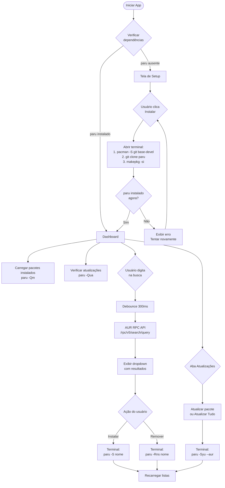

<div align="center">

# ◈ AUR Helper

**Gerenciador de pacotes AUR moderno para Arch Linux**

*Desktop app nativo construído com Rust + Iced — tema Cyberpunk*


**Autor:** [Thiago Luciano](https://github.com/tlsilva89)

</div>

---

## Sobre o Projeto

O **AUR Helper** é uma aplicação desktop para gerenciamento visual de pacotes do [AUR (Arch User Repository)](https://aur.archlinux.org/). Inspirado no layout do KDE Plasma Discover, porém com uma estética **cyberpunk** moderna, ele elimina a necessidade de usar o terminal para operações cotidianas com pacotes AUR.

A aplicação cuida de toda a configuração inicial — incluindo a instalação do próprio `paru` — e oferece uma interface fluida para busca, instalação, atualização e remoção de pacotes.

---

## Instalação Rápida (sem precisar de Rust)

> Baixe o executável pré-compilado diretamente na página de [Releases](https://github.com/tlsilva89/aur-helper/releases).

```bash
chmod +x aur-helper
./aur-helper
```

Ou instale no sistema para rodar de qualquer lugar:

```bash
sudo install -Dm755 aur-helper /usr/local/bin/aur-helper
aur-helper
```

---

## Funcionalidades

| Recurso | Descrição |
|---|---|
| **Setup Automático** | Detecta e instala `git`, `base-devel` e `paru` automaticamente |
| **Busca no AUR** | Campo de busca com debounce e resultados em dropdown em tempo real |
| **Pacotes Instalados** | Lista todos os pacotes AUR instalados no sistema |
| **Verificação de Updates** | Detecta atualizações disponíveis para pacotes AUR |
| **Instalar / Remover** | Operações com feedback visual e abertura de terminal |
| **Atualizar Tudo** | Atualiza todos os pacotes AUR com um clique |

---

## Requisitos

### Sistema Operacional
- **Arch Linux** (ou derivados: Manjaro, EndeavourOS, Garuda, etc.)

### Dependências de Runtime
> A aplicação verifica e instala automaticamente as dependências abaixo se elas não estiverem presentes.

| Dependência | Uso |
|---|---|
| `git` | Clonagem de repositórios AUR |
| `base-devel` | Compilação de pacotes via `makepkg` |
| `paru` | AUR helper — busca, instalação e remoção de pacotes |

---

## Guia do Usuário

### Primeira Execução — Setup Automático

Ao abrir o AUR Helper pela primeira vez, a aplicação verifica se `git`, `base-devel` e `paru` estão instalados.

```
╔══════════════════════════════════════════╗
║           AUR HELPER                    ║
║    Gerenciador de Pacotes AUR           ║
║                                         ║
║  CONFIGURAÇÃO NECESSÁRIA                ║
║                                         ║
║  Dependências detectadas:               ║
║  ✔  git           instalado            ║
║  ✖  base-devel    ausente              ║
║  ✖  paru          ausente              ║
║                                         ║
║  [ Instalar Dependências ]              ║
╚══════════════════════════════════════════╝
```

Ao clicar em **"Instalar Dependências"**, um terminal é aberto automaticamente e o processo acontece em 3 etapas:

1. Instalação de `git` e `base-devel` via `pacman`
2. Clone do repositório oficial do `paru`
3. Compilação e instalação do `paru` via `makepkg`

> **Nota:** Você precisará fornecer sua senha de `sudo` durante a instalação. O processo pode levar alguns minutos na primeira vez pois o `paru` é compilado do código-fonte em Rust.

Após a conclusão, o terminal fecha automaticamente e a aplicação carrega o Dashboard.

---

### Dashboard Principal

```
╔══════════════════════════════════════════════════════╗
║  ◈ AUR HELPER              [ Buscar no AUR... ] ⌕  ║
╠══════════════════════════════════════════════════════╣
║  Instalados (12)   |   Atualizações (2) ●           ║
╠══════════════════════════════════════════════════════╣
║  visual-studio-code-bin    1.89.0-1    [Remover]    ║
║  google-chrome             126.0-1     [Remover]    ║
║  discord                   0.0.46-1    [Remover]    ║
║  ...                                                ║
╠══════════════════════════════════════════════════════╣
║  ● Sincronizado  •  12 pacotes  •  2 atualizações   ║
╚══════════════════════════════════════════════════════╝
```

#### Buscar e Instalar um Pacote

1. Clique na barra de busca no canto superior direito
2. Digite o nome do pacote — mínimo 2 caracteres
3. Aguarde os resultados aparecerem (busca automática com 300ms de debounce)
4. Cada resultado exibe: **nome**, **versão**, **votos ★**, **status** (instalado/AUR)
5. Clique em **"Instalar"** — um terminal será aberto com o processo completo

#### Remover um Pacote

Na aba **"Instalados"**, clique em **"Remover"** ao lado do pacote desejado. O comando executado é `paru -Rns <pacote>`, que remove o pacote e suas dependências órfãs.

#### Verificar e Aplicar Atualizações

- A aba **"Atualizações"** lista todos os pacotes AUR com versões mais recentes disponíveis
- Clique em **"Atualizar"** para atualizar um pacote individualmente
- Clique em **"Atualizar Tudo"** para aplicar todas as atualizações de uma vez
- Use o botão **"↻ Verificar Atualizações"** no rodapé para atualizar a lista manualmente

---

## Especificações Técnicas

### Stack

| Componente | Tecnologia | Versão |
|---|---|---|
| Linguagem | Rust | 1.75+ |
| Framework UI | [iced](https://iced.rs) | 0.13 |
| Runtime Async | tokio | 1 |
| HTTP Client | reqwest | 0.12 |
| Serialização | serde + serde_json | 1 |

### Arquitetura

A aplicação segue o padrão **MVU (Model-View-Update)** nativo do Iced:

- **Model** — Estado da aplicação (`App`, `SetupState`, `DashboardState`)
- **View** — Funções puras que transformam estado em UI (`pages/*.rs`)
- **Update** — Função que processa mensagens e retorna novas Tasks (`App::update`)

### Estrutura de Arquivos

```
aur-helper/
├── Cargo.toml
├── publish.sh
├── .gitignore
├── .github/
│   └── workflows/
│       └── release.yml
└── src/
    ├── main.rs
    ├── core/
    │   ├── mod.rs
    │   ├── config.rs
    │   ├── models.rs
    │   ├── shared.rs
    │   └── services/
    │       ├── mod.rs
    │       ├── validator.rs
    │       └── package_manager.rs
    ├── pages/
    │   ├── mod.rs
    │   ├── check_env.rs
    │   └── dashboard.rs
    └── ui_components/
        └── mod.rs
```

### API de Busca

A busca utiliza diretamente a **AUR RPC v5 API** — sem depender do `paru` para pesquisa:

```
GET https://aur.archlinux.org/rpc/v5/search/{query}
```

### Comandos Paru Utilizados

| Operação | Comando |
|---|---|
| Listar instalados (AUR) | `paru -Qm` |
| Verificar atualizações | `paru -Qua` |
| Instalar pacote | `paru -S --noconfirm <nome>` |
| Remover pacote | `paru -Rns --noconfirm <nome>` |
| Atualizar tudo | `paru -Syu --aur --noconfirm` |

### Gerenciamento de Permissões

Operações que requerem `sudo` são executadas dentro de um **emulador de terminal externo**, detectado automaticamente na seguinte ordem de preferência:

`alacritty` → `kitty` → `konsole` → `gnome-terminal` → `xfce4-terminal` → `foot` → `xterm`

### Paleta Cyberpunk

| Nome | Hex | Uso |
|---|---|---|
| `BG_PRIMARY` | `#0A0A17` | Fundo principal |
| `BG_SECONDARY` | `#111126` | Header, footer, painéis |
| `BG_CARD` | `#171730` | Cards de pacotes |
| `CYAN` | `#00F2FF` | Destaque principal, links |
| `PURPLE` | `#7B30FF` | Badge AUR, acentos |
| `PINK` | `#FF1291` | Alertas, configuração |
| `NEON_GREEN` | `#00FF88` | Sucesso, botão instalar |
| `DANGER` | `#FF3366` | Remover, erros |
| `WARNING` | `#FFCC00` | Atualizações disponíveis |

---

## Fluxo da Aplicação



---

## Desenvolvimento

### Clonar e rodar em modo debug

```bash
git clone https://github.com/tlsilva89/aur-helper.git
cd aur-helper
cargo run
```

### Verificação de tipos sem compilar

```bash
cargo check
```

### Gerar binário local em `linux-publish/`

```bash
./publish.sh
```

### Publicar uma Release no GitHub

O GitHub Actions compila e publica automaticamente ao criar uma tag:

```bash
git tag v1.0.0
git push origin v1.0.0
```

O executável ficará disponível para download na página de [Releases](https://github.com/tlsilva89/aur-helper/releases) — sem precisar de Rust instalado.

### Variáveis de ambiente úteis em desenvolvimento

```bash
RUST_LOG=iced=debug cargo run
RUST_BACKTRACE=1 cargo run
```

---

## Contribuindo

Contribuições são bem-vindas! Para propor mudanças:

1. Faça um fork do repositório
2. Crie uma branch: `git checkout -b feature/minha-feature`
3. Commit suas mudanças: `git commit -m 'feat: adiciona minha feature'`
4. Push para a branch: `git push origin feature/minha-feature`
5. Abra um Pull Request

### Convenções de commit

Este projeto segue [Conventional Commits](https://www.conventionalcommits.org/):

| Prefixo | Uso |
|---|---|
| `feat:` | Nova funcionalidade |
| `fix:` | Correção de bug |
| `ui:` | Mudança visual |
| `refactor:` | Refatoração sem mudança funcional |
| `docs:` | Documentação |

---

## Licença

Distribuído sob a licença MIT. Veja [LICENSE](LICENSE) para mais informações.

---

<div align="center">

Feito com ♥ por **[Thiago Luciano](https://github.com/tlsilva89)**

*"btw I use Arch"*

</div>
